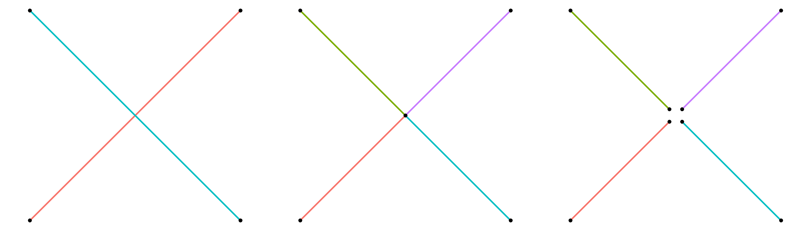
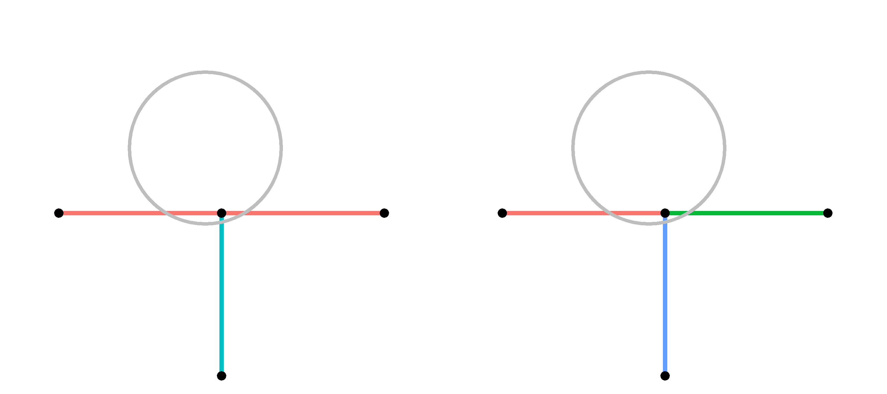
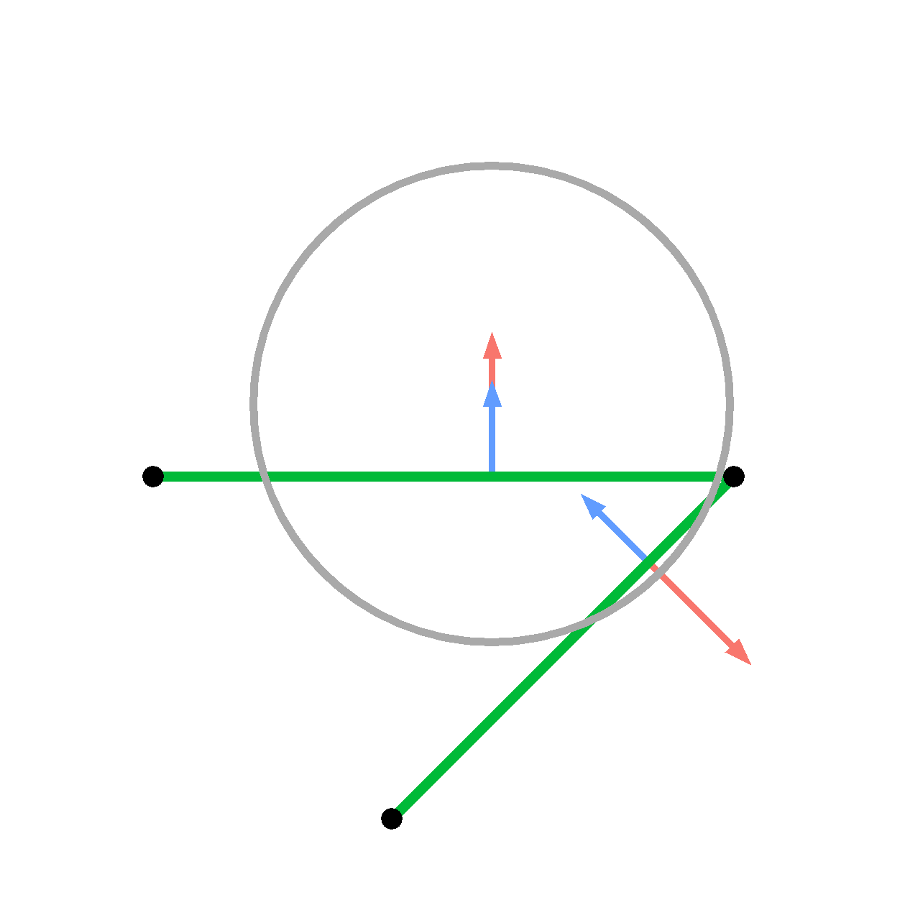
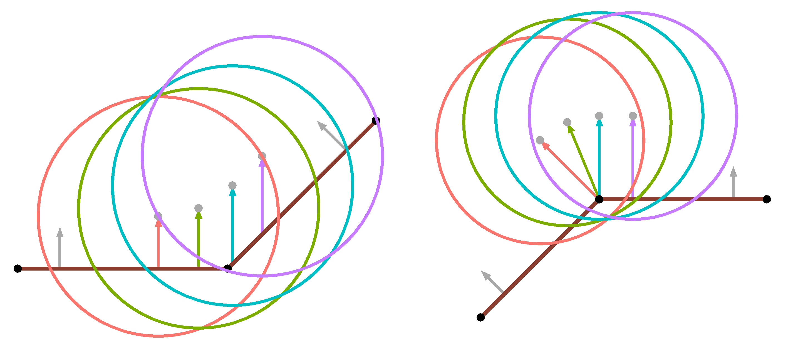
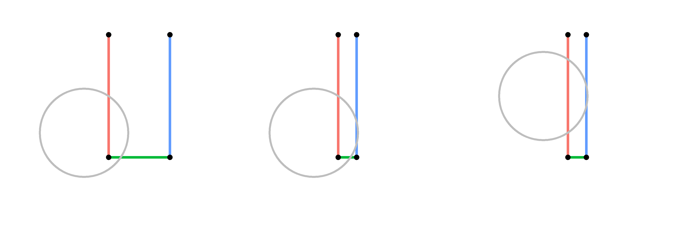

Granular surfaces
=================

.. versionadded:: TBD

As explained on the :doc:`Howto granular <Howto_granular>` doc page,
granular systems are composed of spherical particles with a diameter, as
opposed to point particles.  This means they have an angular velocity
and torque can be imparted to them to cause them to rotate.

The :doc:`Howto granular <Howto_granular>` doc page lists various atom,
pair, fix, and compute styles useful for creating granular models for
systems of interacting particles.

This page explains how you can also define granular surfaces which are a
collection of triangles (3d systems) or line segments (2d systems),
which act as boundaries interacting with the particles.  Different kinds
of particle/surface interactions can be specified with similar options
as the :doc:`granular pair style <pair_granular>` command.

----------

Global versus local surfaces
""""""""""""""""""""""""""""

A key point to understand is that LAMMPS supports two forms of granular
surfaces.  You cannot use both in the same simulation.

The first is *global* which means that each processor stores a copy of
all the triangles/lines.  This is suitable when a modest number of
triangles/lines is needed.  They can be large triangles/lines, any of
which span a significant fraction of the simulation box size in one or
more dimensions.

The second is *local* which means that the collection of triangles/lines
is distributed across processors in the same manner that particles are
distributed.  Each processor is assigned to a sub-domain of the
simulation box and owns whichever triangles/lines have their center
point in the processor's sub-domain.  Similar to particles, each
processor may also own ghost copies of triangles/lines whose finite size
overlaps with the processor's sub-domain.  The total number of
triangles/lines in the system can now be very large.  For effective
distribution and minimal communication, all the triangles/lines should
be small, no more than a few particle diameters in size.  If even one
larger triangle or line is defined then the neighbor list cutoff and
communication cutoff will be set correspondingly larger, which can slow
down the simulation.  Note that a large triangle are line can instead be
defined as multiple smaller triangles or lines without changing the
topology of the collective surface.

One of these two commands must be specified to use *global* or *local*
surfaces in your granular simulation:

* :doc:`fix surface/global <fix_surface_global>`
* :doc:`fix surface/local <fix_surface_local>`

The :doc:`fix surface/global <fix_surface_global>` command reads in the
global surfaces in one of two ways.  The first option is from a molecule
file(s) previously defined by the :doc:`molecule <molecule>` command.
The file should define triangles or lines with header keywords and a
Triangles or Lines section.  The second option is from a text or binary
STL (stereolithography) file which defines a set of triangles.  It can
only be used with 3d simulations.

The :doc:`fix surface/local <fix_surface_local>` command defines local
surface in one of three ways.  The first two options are the same
molecule and STL files explained in the previous paragraph.  In this
case, the list of triangles/lines is distributed across processors based
on the center point of each triangle/line.  The third option is to
include them in a LAMMPS data file which has been previously read in via
the :doc:`read_data <read_data>` command.  If the file has a Triangles
or Lines section, then triangles/lines will be read in and distributed
along with any particles the data file includes, assuming an appropriate
:doc:`atom_style <atom_style>` has been specified, as explained below.

----------

Surface attributes
""""""""""""""""""

For both global and local surfaces, each triangle/line is assigned a
*type* and a *molecule ID*.  This is done when surfaces are read-in from
a molecule, STL, or data file.  Since STL files do not define types or
molecule IDs, the :doc:`fix surface/global <fix_surface_global>` and
:doc:`fix surface/local <fix_surface_local>` commands specify the type
and molecule ID that will be assigned to the read-in triangles.  The
:doc:`fix surface/global <fix_surface_global>` command also allows use
of the :doc:`fix_modify type/region <fix_modify>` command to assign
types based on a geometric region.  Since local surfaces are effectively
particles, the :doc:`set <set>` command can be used to alter the *type*
or *molecule ID* of any triangle or line.

For both global and local surfaces, types are used to define the style
of granular interactions for individual triangles/lines.  Different
styles can be used within a single object consisting of connected
triangles/lines.  See the Surface Connectivity section below.

Molecule IDs are used to determine which triangles/lines are connected.
They are therefore intended to be assigned uniquely to each
inter-connected set of triangles/lines, as if each object were a
"molecule".

For local surfaces, the molecule ID can be used to define groups which
enables assignment of different motions to different surface objects.
See the Surface Motion section below.  Various other LAMMPS commands
operate on groups or molecules and can thus be used to gather statistics
about or output information about individual surface objects.

----------

Atom styles for granular surfaces
"""""""""""""""""""""""""""""""""

For all three ways of defining *local* surfaces, the triangles/lines are
stored internally in LAMMPS as triangle-style or line-style particles.
This means you must use a hybrid atom style which includes one of these
two sub-styles (for 3d or 2d):

* :doc:`atom_style tri <atom_style>` for 3d simulations
* :doc:`atom_style line <atom_style>` for 2d simulations

The atom_style hybrid command must also define a :doc:`atom_style sphere
<atom_style>` sub-style for the granular particles which interact with
the surfaces.

Note that for molecule or STL file input, the :doc:`fix surface/local
<fix_surface_local>` command reads the file(s) and uses the values for
each surface to create a single new triangle or line particle.  For data
file input, the triangle/line particles are created when the data file
is read.

For granular simulations with *global* surfaces, a hybrid atom style
which defines triangle-style or line-style particles should NOT be used.
Typically only an :doc:`atom_style sphere <atom_style>` command is
needed to define the properties of particles in the simulation.  The
triangles/lines are stored by the :doc:`fix surface/global
<fix_surface_global>` command and not as triangle-style or line-style
particles.

----------

Rules for surface topology
""""""""""""""""""""""""""

For both *global* and *local* surfaces, granular particles interact with
both sides of each triangle or line segment.  This means a surface such
as a mixer blade can be infinitely thin.

Triangles and line segments can be "connected" to form a contiguous
surface if they share common edges or corner point (triangles) or end
points (line segments).  Each triangle edge or corner point can be
shared by multiple adjacent triangles.  A triangle edge is shared by two
triangles if both the end points of the edge are corner points of both
triangles.  A triangle corner point is shared by two triangles if it is
a corner point of both.  Likewise a line segment end point is shared by
two line segments if it is an end point of both segments.

.. NOTE: say something about epsilon criterion for "shared" ?

There is no requirement that a triangle edge or triangle corner point or
line segment end point be connected to another triangle or line segment.
If an edge or point has no connection, it is a free (unconnected) edge
or point.  Particles interact with the free edge or corner point in a
manner consistent with forces generated by particles overlapping with
the interior of a triangle or line segment.

.. NOTE: need an explanation of PBC

No check is made to see if two triangles or line segments intersect each
other; this is allowed if it makes sense for the geometry of the
collection of surfaces.  However, intersections can cause issues if the
missing connectivity leads to inaccurate forces.

As an example of a valid intersection, consider a 2d simulation which
mixes a container of granular particles.  *Global* line segments are
used to define both the box-shaped container and the mixer in the
center.  The 4 mixer blades are in the shape of a large X and are made
to rotate using the :doc:`fix_modify <fix_modify>` command (see below).

The 2 blades could be defined by 2 line segments which cross each other
at their centers (left).  Or the 2 blades could be defined by 4 line
segments, all of which have a common endpoint at the center of the mixer
(middle).  Or the 2 blades could be defined by 4 non-touching line
segments, all of which have a distinct endpoint near the center of the
mixer, but displaced from it by a distance less than the radius of a
granular particle (right).  In any of these cases, when a particle gets
very close to the center of the mixer it will interact with both nearby
line segments as expected.

As an example of an invalid intersection, consider a 2d simulation of a
T shaped object defined by 2 line segments (next figure, left).  The
vertical line segment (blue) ends at the midpoint of the horizontal line
segment (red).  Without proper connectivity, there is no way to censor a
force from the geometrically hidden vertical segment as a particle
(gray) moves horizontally across the top of the T.  In contrast, if the
T shape is defined by 3 line segments that all share a common endpoint
at the center of the top of the T (right), then the connectivity would
censor the force from the vertical segment (blue).

See the next section on connectivity for how two triangles or line
segments are treated if they share a common edge (triangle) or point
(triangle or line).

----------

Surface connectivity
""""""""""""""""""""

If multiple triangles/lines are used to define a contiguous surface
which is flat or gently curved or has sharp edges or corners, LAMMPS
will detect when two or more line segments (2d) in the same molecule
share the same endpoint.  Or when two or more triangles (3d) in the same
molecule share the same edge or same corner point.

This connectivity is stored internally and is used when appropriate to
calculate accurate forces on particles which simultaneously overlap with
2 or more connected triangles or line segments.

Consider the simulation model of the previous section for a 2d mixer now
defined by *local* line segments.  The flat surface of each mixer blade
(and container box faces) is defined by multiple small line segments.
It is important that these line segments be "connected" so that when a
particle contacts two adjacent line segments at the same time, the
resulting force on the particle is the same as it would be if it were
contacting the middle of a single long line segment.

Here is how to ensure that LAMMPS detects the appropriate connections.

For either *global* or *local* surfaces, if the triangles/lines are
defined in a molecule or STL file, then 3 corner points (triangle) or 2
end points (line) will be listed for each triangle/line in the file.
LAMMPS will only make a connection between 2 triangles or lines if a
shared point is EXACTLY the same in both.  This is a single point in
both for a corner point or end point connection.  It is two points in
both triangles for an edge connection.

For *local* surfaces, if the triangles/lines are defined in a data file,
then 3 corner points (triangle) or 2 end points (line) will be listed
for each triangle/line in the file.  However in this case, LAMMPS will
allow for an INEXACT match of a shared point to make a connection
between 2 triangles or lines.  Again, this is a single point in both for
a corner point or end point connection.  It is two points in both
triangles for an edge connection.

An INEXACT match means that the two points can be EPSILON apart.
EPSILON is defined as a tiny fraction (1.0e-4) of the size of the
smallest triangle or line in the system.

The reason INEXACT matches are allowed is that data files can be created
in a variety of manners, including by LAMMPS itself as a simulation runs
via the :doc:`write_data <write_data>` command.  Internally,
triangle-style and line-style particles do not store their corner points
directly.  Instead, the center point of the triangle/line is stored,
along with an orientation of the triangle/line and a displacement vector
from the center point for each corner point.  This means that when new
corner points values are written to a data file for two different
triangles/line, they may differ by epsilon due to round-offs in
finite-precision arithmetic.

Note that due to how connectivity is defined, two triangles/lines will
not be connected if their corner points are separated by even small
distances (greater than EPSILON).  Likewise they will not be connected
if the corner point of one triangle/line is very close to (or even on)
the surface of another triangle or middle of another line segment.  In
general these kinds of granular surfaces could be problematic and should
be avoided, but LAMMPS does not check for these conditions.

In addition, note that connectivity is only defined between two
triangles/lines of the same molecule ID.  This way surfaces of two
molecules can move independently, as described in the following section.

Note that if a triangle or line segment has a free edge or free
corner/end point (not connected to any other triangle/line), granular
particles will still interact with the triangle/line if the nearest
contact point to the spherical particle center is on the free edge or is
the free corner/end point.

----------

Surface motion
""""""""""""""

By default, surface triangles/lines are motionless during a simulation,
whether they are *global* or *local*.  Triangles/lines impart forces and
torques to granular particles, but the inverse forces/torques on the
triangles/lines do not cause them to move.

However, triangles/lines can be made to move in a prescribed manner.
E.g. the rotation of 2d mixer blades in the example described above.
These two commands can be used for that purpose:

* :doc:`fix_modify move <fix_modify>` for *global* surfaces
* :doc:`fix move <fix_move>` for *local* surfaces

For *global* surfaces, the :doc:`fix_modify move <fix_modify>` command
can move a specified subset of the triangles/lines in various ways
(translation, rotation, etc).  Which triangles move is specified based
on the *molecule ID* of each triangle.  Molecule IDs are specified when
surfaces are defined by the :doc:`fix surface/global
<fix_surface_global>` command.  They can also be defined by the
:doc:`fix_modify mol/region <fix_modify>` command.

For *local* surfaces, the :doc:`fix move <fix_move>` command can move a
specified subset of the triangles/lines in various ways (translation,
rotation, etc).  Which triangles move is specified based on the group-ID
argument to the :doc:`fix move <fix_move>` command.  Groups of *local*
surfaces can be defined by the :doc:`group <group>` command.

.. note::

   For an object defined by two or more connected triangles/lines, it is
   an error to assign a motion and not include all the connected
   triangles/lines, since this would break the connections.  LAMMPS
   checks this for *global* surfaces but only checks that the fix group
   of any instances of :doc:`fix move <fix_move>` include all or none of
   a set of connected *local* triangles/lines.

----------

Calculation of forces
"""""""""""""""""""""

After generating the surface connectivity, LAMMPS classifies each
connection as being flat or non-flat based on the angular difference
between normal vectors.  The two sides are then classified as being
concave or convex based on their normal vectors.  In scenarios where
flat surfaces are perfectly flat (parallel normal vectors) this
designation is arbitrary.

Each point or edge of a line or triangle are then classified as being
internal, external, or unconnected based on the connectivity.  For
lines, an end point is internal if it only has flat connections,
external if it has at least one non-flat (concave or convex) connection,
and unconnected if it has no connections.  The same is true for edges on
a triangle.  Corners on triangles inherit their classification from the
two edges that meet at it.  If either edge is unconnected, the corner is
unconnected.  Otherwise, the corner is external if either edge is
external, and internal if both edges are internal.

To calculate force on a particle, LAMMPS finds a set of all lines or
triangles that are geometrically in contact with the particle,
:math:`{S}_\mathrm{all}`.  For each line or triangle *i*, LAMMPS
calculates the geometric overlap :math:`\delta_i` and the normal vector
between the contact point on that line/triangle and the particle,
:math:`\hat{n}_{r,i}`.

Depending on the contact model, the force between a particle and a
surface can depend on many variables including relative velocities,
angular velocities, sliding history, etc.  Most importantly, the force
depends on an effective overlap distance :math:`\delta_f` and an
effective point of contact :math:`\vec{r}_c` or (equivalently) the
direction of the normal force :math:`\hat{n}_f`.  If a particle is in
contact with a single line or triangle *i*, there is an unambiguous
geometrically-determined point of contact and overlap such that
:math:`\delta_f = \delta_i` and :math:`\hat{n}_f = \hat{n}_{r,i}`.  If a
particle is in contact with two (or more) lines/triangles that are not
connected, then two forces are applied with overlaps and directions
determined from the geometric values for each line/triangle.  However,
if the particle is in contact with two (or more) connected
lines/triangles, the calculation of :math:`\delta_f` and
:math:`\hat{n}_f` is more complicated and is described in the remainder
of this section.

First, LAMMPS needs to identify a set of consistent sides of contact for
each line/triangle in :math:`{S}_\mathrm{all}`.  For a single line or
triangle, which side or face of the surface is in contact is
unambiguous.  However, if a particle is in contact with two or more
connected lines/triangles this depends on the network of connectivity.
For instance, the below figure highlights a 2D system with a particle
(gray circle) in contact with two (green) lines that are part of a
rhombus shaped object.  From a naive local determination, one would
determine the particle is in contact with the sides/faces of the line
with a surface normal oriented in the blue direction, one of which
points inwards, into the object.  However, through the context of the
convex connection, one can identify the physical surface normals (red).
LAMMPS evaluates a consistent set of sides/faces (setting the sign of
:math:`\hat{n}_s`) by walking through all connections of contacted
surfaces starting from the primary contact.  If there are still
unchecked surfaces, LAMMPS finds the unchecked surface with the largest
overlap and repeats the process.

Next, LAMMPS clusters all contacted lines/triangles into distinct
composite sets each consisting of mutually flat line/triangle surfaces
that act as one physical object, denoted :math:`{S}_{n}` where *n*
labels a particular composite.  For instance, if a particle is touching
two flat-connected surfaces and a third concave-connected surface, it
will group them into two composite surfaces of size two and one.  Each
composite set of surfaces calculates an effective contact point and
applies a single force on the particle.  This clustering is performed by
starting with the primary contact and checking all of its connections.
Flat connections are added to the current set of surfaces
:math:`{S}_{n}` and to a list of surfaces which need to be walked.
Non-flat connections are skipped, however, convex connections with
smaller overlaps are first flagged to be hidden (described below).
LAMMPS then iterates one-by-one through the list of surfaces to be
walked until it is empty.  This effectively searches all 1st flat
neighbors of the primary contact, then flat 2nd neighbors, etc.  LAMMPS
then identifies the next unprocessed surface with the largest overlap
(the new primary contact) and repeats the process to create a new set of
composite surfaces :math:`{S}_m` and continues until all contacting
surfaces in :math:`{S}_\mathrm{all}` have been added to a composite set
(which can consist of single surface).  While performing this walk, any
hidden flags are passed along to subsequently walked flat connecting
surfaces such that the hidden status cascades around a convex turn.

For each composite set of flat surfaces :math:`{S}_n`, LAMMPS calculates
a single force from an effective net overlap :math:`\delta_f` and
direction :math:`\hat{n}_f`.  Before calculating :math:`\delta_f`, the
individual overlap of any hidden surface *i* is zeroed, :math:`\delta_i`
= 0.  Then :math:`\delta_f = \mathrm{max}(\delta_i | i \in {S}_n)`.  The
direction of the force is a weighted average across all surfaces in the
set :math:`{S}_n` or :math:`\hat{n}_f = A \sum W_i \delta_i
\hat{n}_{f,i}` where :math:`\hat{n}_{f,i}` is a calculated direction of
force for that surface, :math:`W_i` is a per-surface weight, and
:math:`A` is a normalization factor.

Before describing the calculation of individual directions,
:math:`\hat{n}_{f,i}`, and weights, :math:`W_i`, for surfaces in a
composite, LAMMPS calculates a general weight for externally vs.
internally contacted surfaces defined as :math:`W_\mathrm{ext} \equiv
(\delta_\mathrm{max,ext} / \delta_\mathrm{max})^2` and
:math:`W_\mathrm{int} \equiv 1 - W_\mathrm{ext}`, respectively, where
:math:`\delta_\mathrm{max,ext}` is the maximum overlap with an
externally contacted surface in that composite set :math:`{S}_n`.  This
weighting is used to emphasize contributions from surfaces on a convex
boundary as a particle moves along the convex turn.

In 2D, a surface *i*'s weight :math:`W_i` is either
:math:`W_\mathrm{ext}` or :math:`W_\mathrm{int}` based on its status.
By default, :math:`\hat{n}_{f,i}` is simply the direction from the local
contact point on that surface to the particle, :math:`\hat{n}_{r,i}`.
Note that if the contact point is inside of the line, then
:math:`\hat{n}_{r,i}` is equivalent to the surface normal
:math:`\hat{n}_{s,i}`.  However, there are two exceptions: (a) if the
contact is at a concave-connected point then :math:`\hat{n}_{f,i} =
\hat{n}_{s,i}`, and (b) if the contact is at a convex-connected point
and :math:`\hat{n}_{r,i}` has a component pointing into the neighboring
line vector of *j* then :math:`\hat{n}_{f_i} = \hat{n}_{s,j}`.  These
rules place limits on how how much a resulting force can point into the
connected line *j* to ensure :math:`\hat{n}_{f_i}` smoothly varies as
the particle turns the bend.  A few details are worth noting.  First, as
non-flat connecting surfaces are hidden behind convex turns
(:math:`\delta_i = 0`), the limit in the convex scenario is only
relevant for connections that are both flat and convex.  Secondly, if
two flat lines are perfectly parallel, then :math:`\hat{n}_{f,i} =
\hat{n}_{s,i} = \hat{n}_{s,j}` implying the concave/convex designation
has no effect.  Lastly, if a point is shared by more than two lines,
then LAMMPS finds which connecting line has a normal vector closest to
:math:`\hat{n}_{s,i}` to determining whether its a concave or convex
connection.

To illustrate, these scenarios are visualized in the figure below.  In
the left panel, a particle at various positions (red, green, blue, and
purple) contacts a concave bend made up of two lines (coral brown).
Here the leftmost line is labeled *i* and the rightmost line is labeled
*j*.  The direction of the force :math:`\hat{n}_{f,i}` from line *i* is
indicated by arrows.  Along the entire contact, :math:`\hat{n}_{f,i} =
\hat{n}_{s,i}` where the normal vectors for each line are indicated by
gray arrows for clarity.  If alternatively :math:`\hat{n}_{f,i} =
\hat{n}_{r,i}`, then the force at the right most positions (blue/purple)
would have a relatively large component parallel to the adjacent line
*j* which would produce an unphysical wobble in the direction of the net
force from the two lines as the particle moved around the bend.  In the
right panel, the contact point is at a convex corner such that
:math:`\hat{n}_{f,i} = \hat{n}_{r,i}` (red, green) unless
:math:`\hat{n}_{r,i}` has a component pointing into the the adjacent
line :math:`j`, in which case :math:`\hat{n}_{f,i} = \hat{n}_{s,j}`
(blue, purple).

In 3D, first consider a scenario where there are no contacts with free
or unconnected edges (all edges have at least one connection).  Again,
each composite set of surfaces :math:`{S}_n` calculates a single force.
For each surface, if its contact point is inside of the triangle, then
:math:`\hat{n}_{f,i} = \hat{n}_{s,i}`.  If the contact is on an edge, it
acts much like a point in 2D: a concave connection implies
:math:`\hat{n}_{f,i} = \hat{n}_{s,i}` and a convex connection implies
:math:`\hat{n}_{f,i} = \hat{n}_{r,i}` unless :math:`\hat{n}_{r,i}`
points into the adjacent triangle :math:`j` in which case
:math:`\hat{n}_{f,i} = \hat{n}_{s,j}`.  This is determined by comparing
the three dot products between :math:`\hat{n}_{s,i}`,
:math:`\hat{n}_{s,j}`, and :math:`\hat{n}_{r,i}`.

If a particle contacts a corner, then the corner first calculates what
the :math:`\hat{n}_{f,i}` would be had the particle contacted either of
the two edges, labeled *a* and *b*, :math:`\hat{n}_{f,a}` and
:math:`\hat{n}_{f,b}` (where the *i* is implied from context).  Each of
these edges have normalized line vectors :math:`\hat{l}_a` and
:math:`\hat{l}_b` pointing towards the corner in consideration.

If :math:`\hat{n}_{f,a} \cdot \hat{l}_b < 0` (or if the force from that
edge has a component pointing into the other edge), then
:math:`\hat{n}_{f,a}` is replaced with :math:`\hat{n}_{s,i}`, and vice
versa for edge :math:`b`, to avoid forces pointing into the triangle.  A
resulting :math:`\hat{n}_{f,i}` is then calculated by performing a
weighted average of these two edge contributions such that the result
interpolates between the two limits as a particle moves from contacting
one edge to the corner to the other edge.

The calculation of the two edge weights is more complicated, but a brief
description is provided below to contextualize the code.  Each weight is
primarily a function of several dot products including :math:`C_a =
\hat{n}_{r,i} \cdot \hat{l}_{a}` and :math:`D_a = \hat{n}^p_{r,i} \cdot
\hat{l}_{a}` as well as equivalents for edge :math:`b` where
:math:`\hat{n}^p_{r,i}` is :math:`\hat{n}_{r,i}` projected into the
plane of the triangle.  If the contact is directly above the corner such
that :math:`\hat{n}_{r,i}` is parallel to :math:`\hat{n}_{s,i}`, then
:math:`\hat{n}_{f,i}` is simply set to :math:`\hat{n}_{s,i}` and this
procedure is skipped.  The base weights are then :math:`W_a = (1-C_a)
D_b` and :math:`W_b = (1-C_b) D_a`.  This construction ensures the
weight for, say, edge :math:`a` approaches zero as :math:`\hat{n}_{r,i}`
either aligns with :math:`\hat{l}_a` (at which point the edge cannot
easily calculate a realistic force) or becomes perpendicular to
:math:`\hat{l}_b` such that its contribution dominates.

When evaluating corner contacts, if either of the two edges, say
:math:`a`, has a convex connection and is hiding another triangle, an
additional weight is required for that edge to ensure
:math:`\hat{n}_{f,i}` continuously transitions as the particle moves
across that convex turn to surface :math:`j`.  This is calculated in
terms of the dot product :math:`E_a = \hat{n}^a_{r,i} \cdot
(\delta_{s,i} + \delta_{s,j})/2` where :math:`\hat{n}^a_{r,i}` is
:math:`\hat{n}_{r,i}` after removing any component along
:math:`\hat{l}_a`. :math:`W_b` is then multiplied by :math:`(1-E_a)`
which goes to zero as the particle approaches the threshold before
switching to contacting surface :math:`j` which shares edge :math:`a`.

Lastly, there are forces on particles from unconnected (free) edges or
corners of triangles.  Currently, LAMMPS does not calculate or store the
quasi-2D connectivity information between unconnected edges along a
border and therefore forces are not guaranteed to vary in a physically
realistic manner as a particle moves along it (e.g. forces are not
censored from the far edge as a particle moves along a convex bend in
the border).  However, the below calculation is designed to prioritize
continuity in the direction of force and ensure forces always point away
from the surface's border as expected.  It is generally recommended that
if a surface has an exposed border, it should be designed to be
relatively simple and smooth.

First assume there is only one contacted triangle in a composite set.
Forces from edges are calculated identically to a convex-connected edge.
Unconnected corners (those that have at least one unconnected edge) also
average contributions from their two edges.  If both edges are connected
(or unconnected), this average is the same.  However, if one is
connected and the other is unconnected then the contribution from the
connected edge, say :math:`a`, is modified.

For interpolating between unconnected and connected limits, a general
weighting :math:`W_c = \mathrm{max}(0.0, 1.0 - dr_{uc} /
\delta_\mathrm{max})` is used where :math:`dr_{uc}` is the maximum
in-plane distance away from a triangle's unconnected corner or edge in
the composite set.  If the particle sits on top of the effective surface
from the set, this weight is zero.  As the particle moves off of and
away from this effective surface, the weight approaches one. :math:`W_i`
for all surfaces that are not contacted on an unconnected feature is
then multiplied by :math:`W_c`.  Additionally, these surfaces multiply
:math:`W_i` by a factor of :math:`W_{ip} = \mathrm{min}(1.0,
\hat{n}_{s,i} \cdot \hat{n}_{r,i} / (1 - W_c))`.  This term goes to zero
as the particle moves within the plane of the surface, which practically
should only happen when a particle is outside and away from the surface.
This term avoids complications when internal connections cannot
determine which side of the surface is being contacted.

Lastly, when contacting an unconnected corner which has one unconnected
edge and one connected edge, the contribution from the connected edge is
multiplied by these two factors, :math:`W_c` and :math:`W_{ip}`.

----------

Recommendations for geometries
""""""""""""""""""""""""""""""

When designing geometries for granular surfaces, there are several
things to keep in mind to avoid unintended force contributions and to
improve efficiency.

While convex corners are identified and used to censor forces from
physically hidden sections of a wall, if a particle is not in contact
with the entirety of a convex turn, then forces cannot be properly
censored.  For example, consider a 2d system with a U shaped wall
defined by 3 line segments (see figure).  If the width of the U is wider
than the typical particle-wall overlap (right), no issues are
anticipated.  However, if the width of the U is very thin relative to
the typical particle-wall overlap (middle, right), then a particle could
potentially be in contact with both vertical legs of the U.  If the
particle is also in contact with the base of the U (middle, green), then
it can identify the convex turn and censor forces from the rightmost
vertical leg (blue).  However, if the particle is towards the top of the
U (right) and not in contact with the base (green), then there is no way
for the particle to identify the convex turn and censor forces from the
far vertical wall (blue).  Therefore, walls with very thin features
separated by a gap less than the expected overlap distance between a
particle and a surface can lead to unintended additional forces.

As mentioned in the above section, forces resulting from contact with
unconnected endpoints of lines do point in the expected direction and
experience no discontinuities as the particle moves around the endpoint.
However, in 3D, contacts with unconnected edges only produce reasonably
directed forces oriented away from the edge.  However, the exact
direction of a force can wobble as the contact moves across a series of
disconnected edges and convex turns may not be appropriately censored as
LAMMPS does not currently construct the proper quasi-2d connectivity of
2D features.  Therefore, it is recommended to avoid complex geometries
along unconnected boundaries such as rapid oscillations in- or
out-of-plane such as pleats or sawteeth, relative to the length of an
edge.

To build a neighbor list between particles and lines/triangles, LAMMPS
assigns a radius to each line/triangle that corresponds to the radius of
the circle/sphere that encloses the object.  Therefore, one must be
aware that systems with large disparities between triangle/line and
particle radii may slow down the neighbor list build for and could
benefit from :doc:`the multi neighbor style <neighbor>` for *local*
surfaces.  Furthermore, triangles with very high aspect ratios should
generally be avoided as they can lead to large neighbor lists containing
many particles which are not actually close to being contact with the
triangle (false positives).

----------

Example scripts
"""""""""""""""

The ``examples/gransurf`` directory has example input scripts which use
both *global* and *local* surfaces.  Both 2d and 3d models are included.

Each script produces a series of snapshot images using the :doc:`dump
image <dump_image>` command.  The snapshots visualize both the particles
and granular surfaces.  The snapshots can be animated to view a movie of
the simulation.
