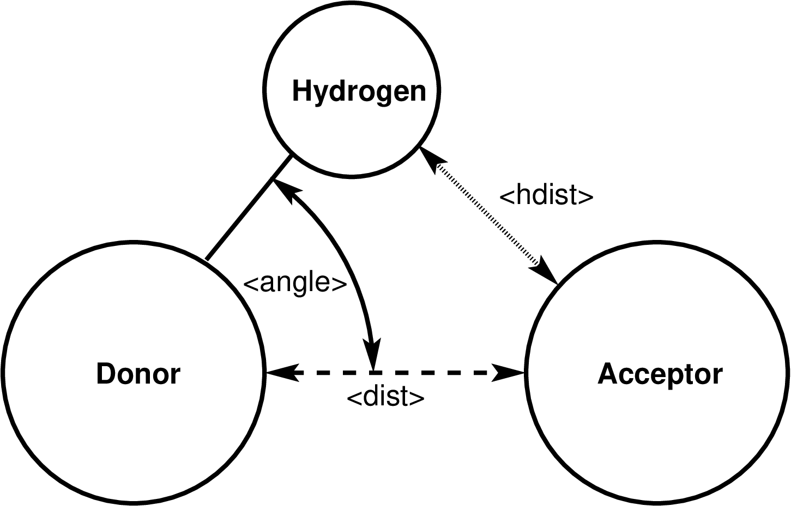

.. index:: compute hbond/local

compute hbond/local command
===========================

Syntax
""""""

.. code-block:: LAMMPS

   compute ID group-ID bond/hlocal rcut acut dgroup-ID agroup-ID hgroup-ID value1 value2 ...

* ID, group-ID are documented in :doc:`compute <compute>` command
* hbond/local = style name of this compute command
* rcut = distance cutoff between hydrogen bond donor and acceptor (distance units)
* acut = angle cutoff for the hydrogen - donor - acceptor angle (degrees)
* dgroup-ID = group-ID of the hydrogen bond donor atoms
* agroup-ID = group-ID of the hydrogen bond acceptor atoms
* hgroup-ID = group-ID of the hydrogen bond hydrogen atoms
  
* one or more values may be appended
* value = *dist* or *angle* or *hdist* or *engpot* or *force*

.. parsed-literal::

     *dist* = distance between hydrogen bond donor and acceptor atoms
     *angle* = hydrogen - donor - acceptor angle
     *hdist* = distance between hydrogen bond hydrogen and acceptor atoms
     *engpot* = hydrogen bond potential energy
     *force* = hydrogen bond force

Examples
""""""""

.. code-block:: LAMMPS

   compute hb all hbond/local 3.2 30.0 dgroup agroup hgroup

Description
"""""""""""

.. versionadded:: TBD

Define a computation that the determines the number of hydrogen bonds
and computes some related properties according to the provided parameters.
To be counted as a hydrogen bond the following conditions have to be met

- the donor atom has to be in the group *dgroup-ID*
- the acceptor atom has to be in the group *agroup-ID*
- the hydrogen atom has to be in the group *hgroup-ID*
- the hydrogen atom has to be connect to the donor with a bond
- all three atoms have to be in the compute group
- the donor - acceptor distance has to be less than *rcut*
- the hydrogen - donor - acceptor angle has to be less than *acut*

   Diagram of the hydrogen bond definition for compute hbond/local

The following values can be computed and output.

- The *dist* value is the current distance between the hydrogen bond
  donor and acceptor atom.
- The *angle* value is the current hydrogen-donor-acceptor angle.
- The *hdist* value is the current distance between the hydrogen atom
  and and hydrogen bond acceptor atom.
- The *engpot* value is the current pairwise energy between the hydrogen
  atom and and hydrogen bond acceptor atom.
- The *force* value is the magnitude of the current pairwise force
  between the hydrogen atom and and hydrogen bond acceptor atom.

Output info
"""""""""""

This compute calculates a global scalar (the number of detected hydrogen
bonds) and a local array containing the atom-ID of the hydrogen bond
donor atom, the atom-ID of the hydrogen bond acceptor atom, the atom-ID
of the hydrogen bond hydrogen atom followed by the properties in the
order they were selected in the compute command line.  The number of
rows in the array is the number of hydrogen bonds; the number of columns
is three plus the number of selected value.  The array can be accessed
by any command that uses local data.

The number of hydrogen bonds

As an example, these commands can be added to the ``examples/peptide/in.peptide``
input /in.rhodo
script to compute the length\ :math:`^2` of every bond in the system and
output the statistics in various ways:

.. code-block:: LAMMPS

   variable dsq equal v_d*v_d

   compute 1 all property/local batom1 batom2 btype
   compute 2 all bond/local engpot dist v_dsq set dist d
   dump 1 all local 100 tmp.dump c_1[*] c_2[*]

   compute 3 all reduce ave c_2[*] inputs local
   thermo_style custom step temp press c_3[*]

   fix 10 all ave/histo 10 10 100 0 6 20 c_2[3] mode vector file tmp.histo

The :doc:`dump local <dump>` command will output the energy, length,
and length\ :math:`^2` for every bond in the system.  The
:doc:`thermo_style <thermo_style>` command will print the average of
those quantities via the :doc:`compute reduce <compute_reduce>` command
with thermo output, and the :doc:`fix ave/histo <fix_ave_histo>`
command will histogram the length\ :math:`^2` values and write them to a file.

----------

The local data stored by this command is generated by three nested
loops: the outer loop is over all atoms that are in the compute group
and either the donor atom group or hydrogen atom group, the second loop
is over all donor - hydrogen atom pairs where the donor atom is

.. TODO: complete the implementation and then the docs

Note that as atoms migrate from processor to processor, there will be no
consistent ordering of the entries within the local array from one
timestep to the next.

The output for *dist* and *hdist* will be in distance :doc:`units
<units>`.  The output for *angle* will be in degrees.  The output for
*engpot* will be in energy :doc:`units <units>`.  The output for *force*
will be in force :doc:`units <units>`.

Restrictions
""""""""""""

This fix is part of the EXTRA-COMPUTE package.  It is only enabled if
LAMMPS was built with that package.  See the :doc:`Build package
<Build_package>` page for more info.

This fix requires that the hydrogen atom is bound to the donor atom
with an explicit bond.  It cannot be used with pair styles like
:doc:`reaxff <pair_reaxff>` where bonds are implicit.

Related commands
""""""""""""""""

:doc:`dump local <dump>`, :doc:`dump image <dump_image>`,
:doc:`compute bond/local <compute_bond_local>`,
:doc:`fix graphics/arrows <fix_graphics_arrows>`

Default
"""""""

none
